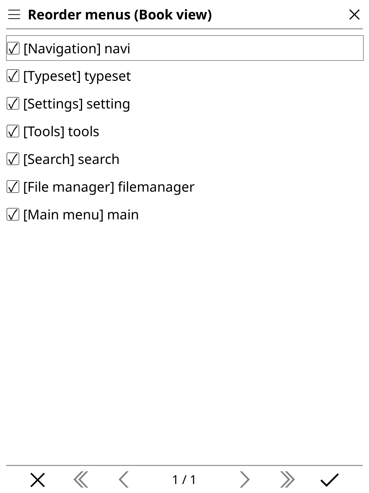
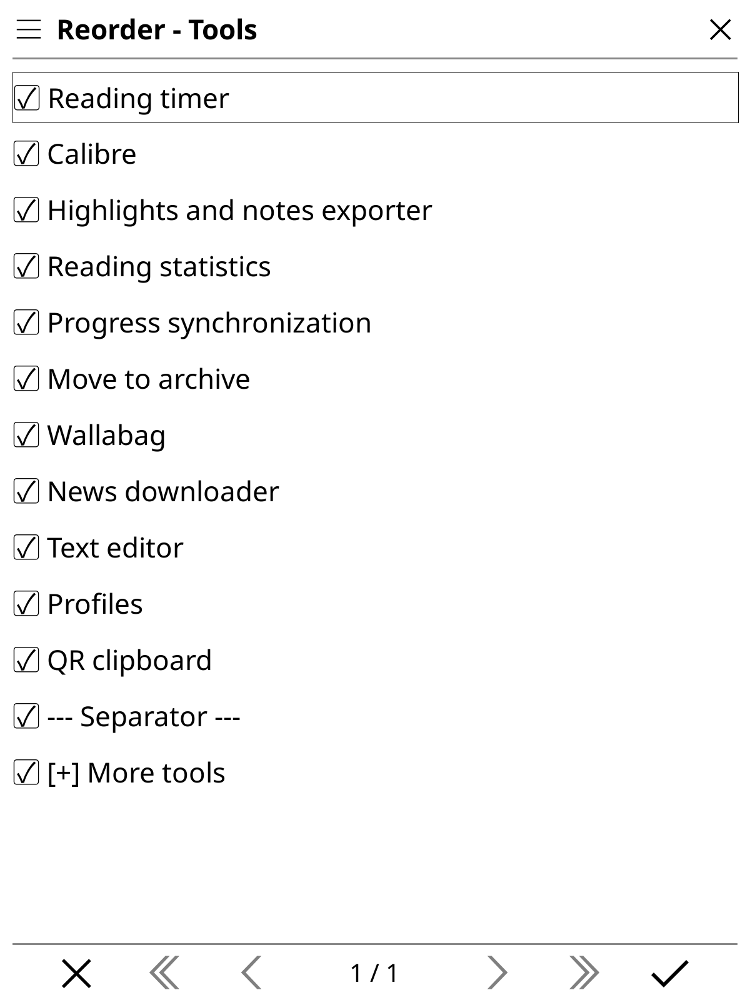
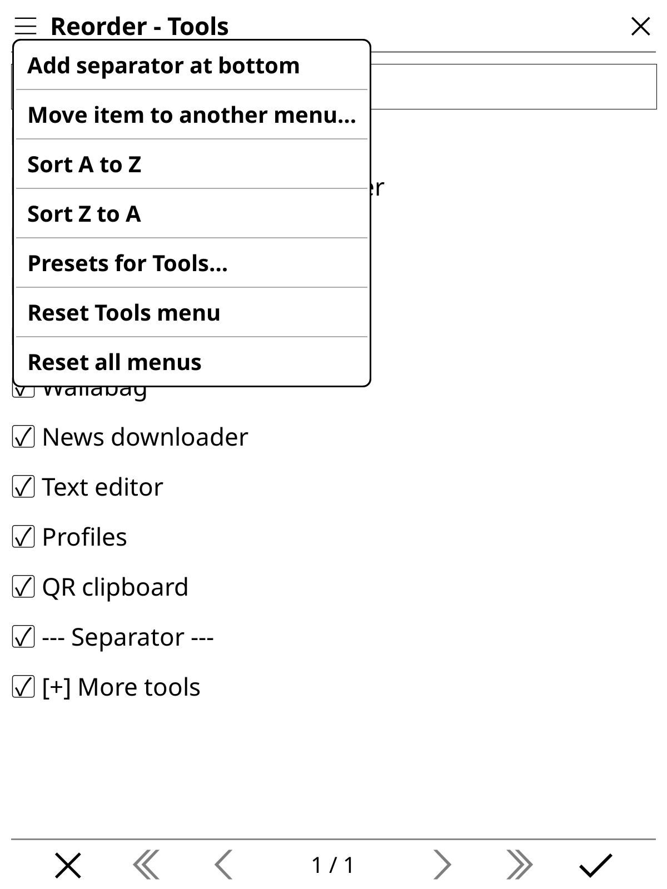
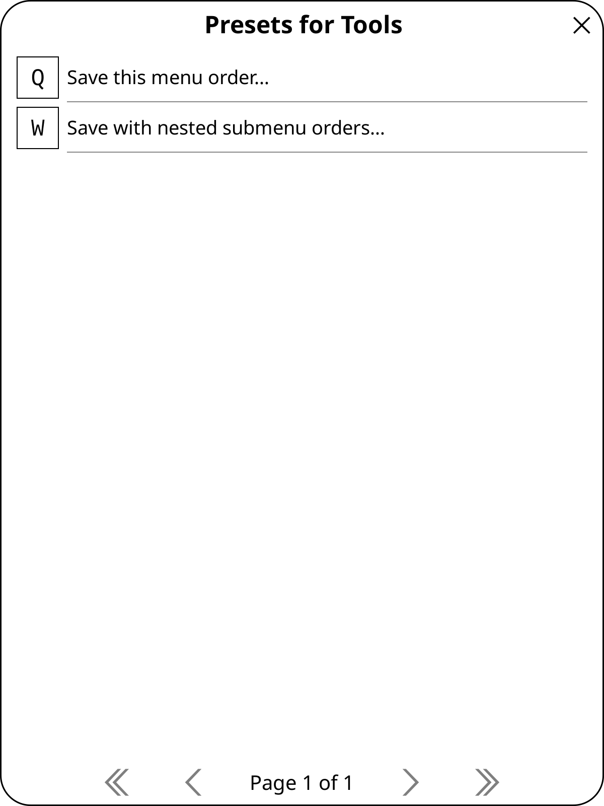

# Reordering Menus for KOReader

Reorder, hide, move, and group KOReader menu items in both Book view and the File Manager, using KOReader's native interface.

<p align="center">
  
  
</p>

<p align="center">
  
  
</p>

## Features

- Reorder the top menus in Book view and the File Manager independently.
- Open and reorder nested submenus at any depth.
- Show only items currently provided by KOReader or installed plugins.
- Pick up newly installed plugin items before they exist in a saved order.
- Show or hide items with the checkbox beside each entry.
- Move an item to another menu or submenu.
- Insert, reposition, and remove separators.
- Sort the current menu from A to Z or Z to A.
- Reset the current Book or Normal menu, an individual submenu, or every menu.
- Save and load complete Book view and File Manager presets.
- Save presets for one submenu only, with optional nested submenu ordering.
- Preserve newly added plugin items when applying submenu presets.

## Installation

1. Download the latest `reorderingmenus.koplugin.zip` from the [Releases](https://github.com/nraikm/ReorderingMenus/releases) page.
2. Unpack it.
3. Move the `reorderingmenus.koplugin` folder into your KOReader `plugins` directory (the same one as your other plugins).
4. Restart KOReader.

## Usage

Open:

```text
Tools → More tools → Reorder menus
```

- Drag entries to change their order.
- Tap a checkbox to show or hide an entry.
- Tap a submenu once to select it, then tap it again to open it. You can also long-press it and choose **Edit submenu contents**.
- Open the hamburger menu for sorting, separators, moving items, presets, and reset actions.
- Tap the checkmark at the bottom to save the current order.

Book view and File Manager layouts are stored separately. The screen title identifies the layout currently being edited as **Book view** or **Normal view**.

## Presets

The top-level hamburger menu contains presets for the complete current view, including several built-in layouts and any custom layouts you save.

Each submenu has its own preset collection under **Presets for _menu name_…**:

- **Save this menu order…** stores only the direct order of the current submenu.
- **Save with nested submenu orders…** also stores the order of every submenu below it.
- `[Direct]` and `[Nested]` prefixes identify the preset scope when loading or deleting presets.

Submenu presets affect ordering only. They do not replace visibility settings, and menu entries introduced by newly installed plugins are retained and appended after the saved order.

## Notes

- Changes are written to KOReader's standard `reader_menu_order.lua` and `filemanager_menu_order.lua` settings files.
- Presets are stored under `settings/menu_order_presets/` in the KOReader data directory.
- A live reload is attempted after changes; KOReader may still request a restart when a complete refresh is needed.
- Third-party plugins can add or remove menu entries. Missing entries in an older submenu preset are ignored, while newly available entries remain accessible.

## Development

Run the tests with the LuaJIT bundled with KOReader. From the KOReader program directory:

```sh
PLUGIN_DIR=/path/to/ReorderingMenus

./luajit "$PLUGIN_DIR/tests/test_reordering.lua"
./luajit "$PLUGIN_DIR/tests/test_koreader_integration.lua"
./luajit "$PLUGIN_DIR/tests/test_ui_robustness.lua"
./luajit "$PLUGIN_DIR/tests/test_presets.lua"
```

Set `KO_HOME` to a separate KOReader data directory when you want an isolated development or test environment.
